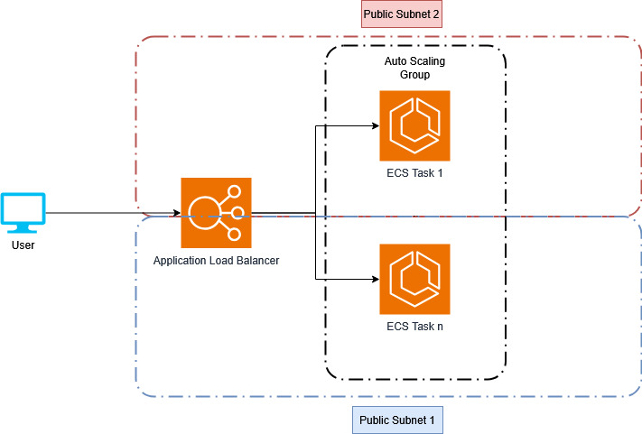

# spring-boot-react-ci-cd-aws-tf

This is a fork of the [spring boot react example](https://gitlab.com/cloud-devops-assignments/spring-boot-react-example). It introduces the following changes:
* Updated npm/node and all javascript libraries used
* Added CI for building the app
* Added CI for building a container around the app and deploying it to the repo-owner's github container repo
* Added Terraform IaC to deploy the app to AWS from local

## Forking and setting up this project
Note: The Containers running in AWS as well as the ALB and everything created will be publicly accessible. The Terraform IaC will create its own VPC network, so there should be no access to any other parts of infrastructure in the AWS Account. I would still advise not to deploy this into any AWS account with very sensitive information/data.

To fork/set up this project yourself, follow these steps:

1. Fork the github repo
2. Change the values in `infrastructure/main.tf` according to you preferences: AWS region, environment name for tagging
3. Set up AWS credentials to be used by terraform locally, i.e. by running `aws configure` using the AWS CLI
4. Set up Github Personal access token(classic) with `read:packages` permission
5. Set up secret in AWS secrets manager with following content: `{"username": "your_github_username", "password": "pat_created_in_previous_step"}
6. Change local variable `container_image` `in infrastructure/main.tf` to `ghcr.io/{your_github_name}/spring-boot-react-ci-cd-aws-tf:latest`
7. Make sure that the `build-and-push` action runs once, for this commit your changes to the `main` branch
8. Run `terraform init`, `terraform validate`, `terraform plan -var="github_secret_arn={your_aws_secrets_manager_secret_arn}"`, `terraform apply -var="github_secret_arn={your_aws_secrets_manager_secret_arn}"` on your local machine

Terraform will output the Load Balancer DNS name, using this you can access the application after 5-10 min startup time.

To destroy the architecture, run `terraform destroy`

## AWS Architecture

The application is run in a container, managed by ECS and Fargate. It is configured with an AutoScaling policy, targeting CPU utilization of 70%. The set-up for testing is running with 0.25 vCPU and 0.5 GB memory per container. It will automatically scale between 1 and 3 tasks.

Incoming traffic is managed by an application load balancer. It distributes traffic between all running containers serving the app.

The app deploys its own VPC network. It has two subnets, containers are spread amongst them, providing resiliency.

App logs are written to a CloudWatch log group, one stream for each task. Each container is monitored with health-checks from the Load Balancer target group.

## Next steps

### Security concerns

Currently two public subnets are used. Move the ECS tasks/containers into a private network and have only the Load Balancer be publicly accessible.

Introduce HTTPS at Load Balancer level to encrypt traffic (keeping the containers unaware of this for separation of concerns.)

### Split frontend and backend into separate containers

This can be done by setting up a separate build process for the frontend, using npm/node to build the application and then copying the artifacts into a container image based on a web-server, that will then host the frontend. One challenge with this is the interdependency between the current frontend and backend. The frontend is served using thymeleaf templating in Spring Boot, and Spring Boot authentication services. This dependency would have to be resolved to split frontend and backend cleanly.

Additionally, the build of the Java Spring Boot application would have to be changed to exclude the frontend, i.e. by modifying the maven build configuration.

### Switch to stand-alone database

By either using a managed DB in the cloud or setting up an additional container running the database, the in-memory database could be retired. This would require changes to the connection setup in the code, as well as providing network connectivity/authentication between backend application and database.

### Setting up a Infrastructure pipeline (CD)

By adding an additional github actions workflow, the infrastructure and application could be deployed continuously. For this, a simple terraform pipeline would suffice. However, a backend to store the terraform state would have to be set up.

## Original Documentation below

The application has a react frontend and a Spring Boot Rest API, packaged as a single module Maven application. You can build the application using maven and run it as a Spring Boot application using the flat jar generated in target (`java -jar target/*.jar`).

You can test the main API using the following curl commands (shown with its output):

---

\$ curl -v -u greg:turnquist localhost:8080/api/employees/3
{
"firstName" : "Frodo",
"lastName" : "Baggins",
"description" : "ring bearer",
"manager" : {
"name" : "greg",
"roles" : [ "ROLE_MANAGER" ]
},
"\_links" : {
"self" : {
"href" : "http://localhost:8080/api/employees/1"
}
}
}

---

To see the frontend, navigate to http://localhost:8080. You are immediately redirected to a login form. Log in as `greg/turnquist`
